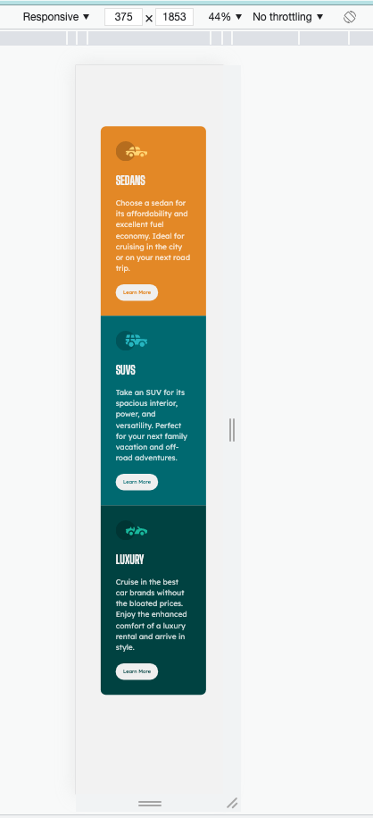
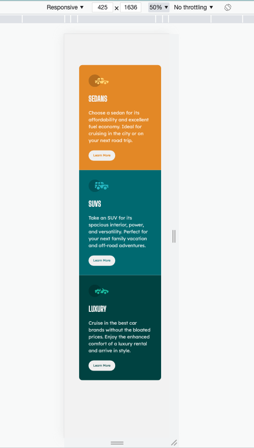
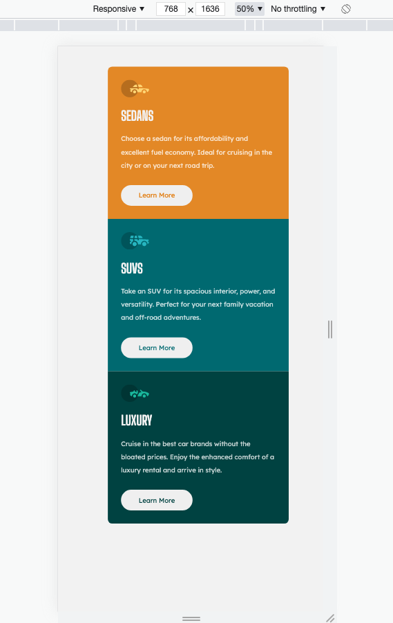
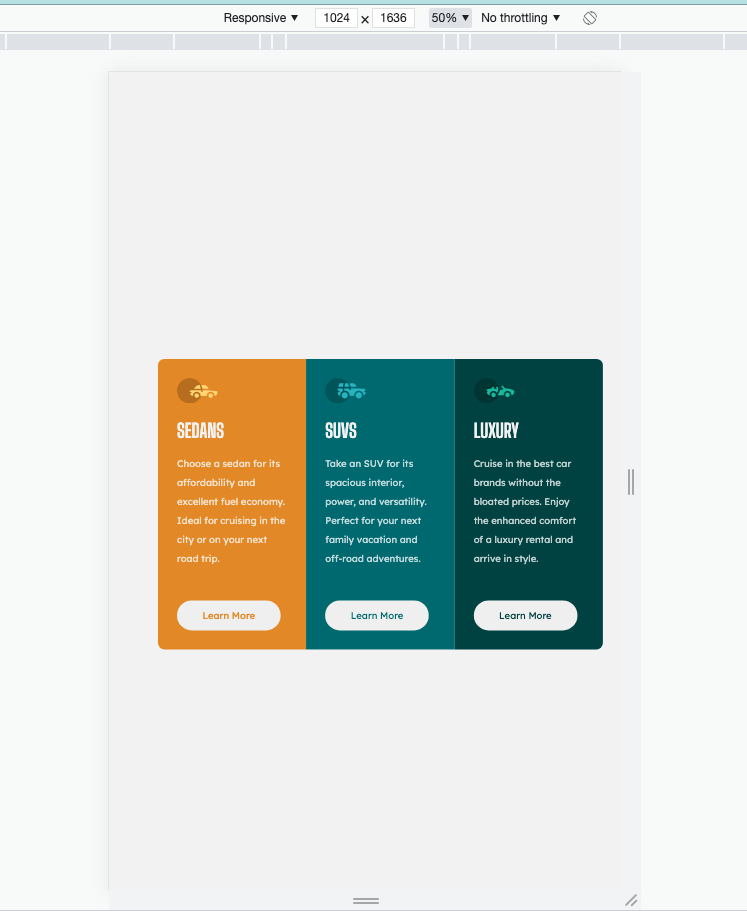
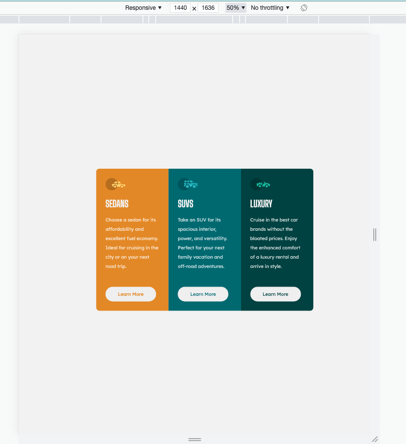

# Frontend Mentor - 3-column preview card component solution

This is a solution to the [3-column preview card component challenge on Frontend Mentor](https://www.frontendmentor.io/challenges/3column-preview-card-component-pH92eAR2-). Frontend Mentor challenges help you improve your coding skills by building realistic projects.

## Table of contents

- [Overview](#overview)
  - [The challenge](#the-challenge)
  - [Final Outcome](#finalOutcome)
  - [Links](#links)
- [My process](#my-process)
  - [Built with](#built-with)
  - [What I learned](#what-i-learned)

## Overview

### The challenge

Your challenge is to build out this 3-column preview card component and get it looking as close to the design as possible.

You can use any tools you like to help you complete the challenge. So if you've got something you'd like to practice, feel free to give it a go.

Your users should be able to:

- View the optimal layout depending on their device's screen size
- See hover states for interactive elements

### Final Outcome

Screen 375  

Screen 425  

Screen 768  

Screen 1024  

Screen 1440  

### Links

- Solution URL: [Github Repo](https://github.com/archana-nagaraj/Frontend-mentor---3-column-preview-card-component)
- Live Site URL: [Github Pages](https://archana-nagaraj.github.io/Frontend-mentor---3-column-preview-card-component/)

## My process

### Built with

- Semantic HTML5 markup
- CSS custom properties
- CSS Grid
- Media queries

### What I learned

- more on adjusting the layout based on different dimensions using media queries

## Author

- Frontend Mentor - [@archana-nagaraj](https://www.frontendmentor.io/profile/archana-nagaraj)
- Github - [@archana-nagaraj](https://github.com/archana-nagaraj)
- Email - [archana.nagaraj](archana.nagaraj@gmail.com)
